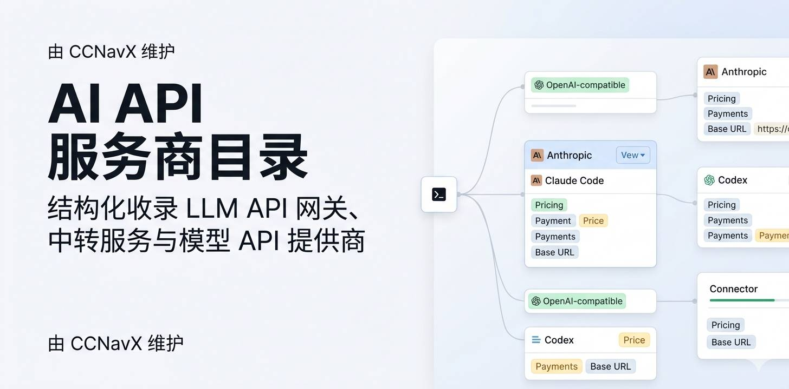

  

# AI API 服务商目录

[English](README.md) | 完整目录：[CCNavX AI API Directory](https://ccnavx.com/directory/ai-api-directory)

这是一个 AI API 服务商、OpenAI 兼容 API 网关、Anthropic 兼容 API 中转、Claude Code API 服务、Codex API 服务与大模型聚合平台的精选列表。

本列表重点记录可直接比较的事实：支持的模型家族、价格是否公开、最低充值、支付方式。完整数据由 [CCNavX](https://ccnavx.com/) 维护，CCNavX 是一个面向 AI API 中转站、模型网关和编程 Agent API 服务的导航与对比站。

## 收录范围

- 面向 GPT、Codex、图像模型的 OpenAI 兼容 API 服务。
- 面向 Claude、Claude Code 工作流的 Anthropic 兼容 API 服务。
- 聚合 OpenAI、Anthropic、Google Gemini、SpaceXAI、DeepSeek 等模型家族的 API 网关。
- 有公开价格、充值额度、订阅方案、支付方式或售后渠道证据的开发者服务。

## 服务商列表

| 服务商 | 价格 | 最低充值 | 支付方式 |
| --- | --- | --- | --- |
| [4AICode](https://ccnavx.com/sites/4aicode) | 公开 | USD 5 | 支付宝、Visa、Mastercard |
| [88API](https://ccnavx.com/sites/88api) | 公开 | USD 1 | 支付宝、微信、USDT、USDC |
| [Ai Go Code](https://ccnavx.com/sites/aigocode) | 公开 | CNY 5 | 微信、支付宝、Visa、Mastercard、Amex |
| [安品AI](https://ccnavx.com/sites/anpin) | 公开 | USD 1 | 支付宝、微信 |
| [APIKey](https://ccnavx.com/sites/apikey) | 公开 | CNY 30 | 微信、支付宝、USDT |
| [AveMujica API](https://ccnavx.com/sites/avemujica) | 公开 | CNY 10 | 支付宝、微信、Stripe |
| [BerryCode](https://ccnavx.com/sites/berrycode) | 公开 | CNY 20 | 微信、USDT、USDC |
| [BMCCA](https://ccnavx.com/sites/bmcca) | 登录后可见 | USD 1 | 支付宝 |
| [Ccode](https://ccnavx.com/sites/ccode) | 公开 | CNY 10 | 支付宝、微信 |
| [CCSub](https://ccnavx.com/sites/ccsub) | 公开 | CNY 20 | 微信、支付宝、USDT |
| [Code CMD](https://ccnavx.com/sites/codecmd) | 公开 | USD 1 | 微信、支付宝、信用卡、USDT |
| [CodexZH](https://ccnavx.com/sites/codexzh) | 公开 | CNY 5.9 | 微信、支付宝 |
| [DDS Hub](https://ccnavx.com/sites/ddshub) | 公开 | CNY 10 | 支付宝、微信 |
| [DeepKey](https://ccnavx.com/sites/deepkey) | 公开 | CNY 5 | 支付宝、微信 |
| [DMXAPI](https://ccnavx.com/sites/dmxapi) | 公开 | CNY 1 | 微信、支付宝 |
| [FK Claude](https://ccnavx.com/sites/fkclaude) | 公开 | CNY 10 | 支付宝 |
| [FoxCode](https://ccnavx.com/sites/foxcode) | 公开 | CNY 35 | 支付宝 |
| [简易API](https://ccnavx.com/sites/jeniya) | 公开 | CNY 1 | 微信、支付宝、USDC、USDT |
| [kukuai](https://ccnavx.com/sites/kukuai) | 公开 | CNY 6.8 | 支付宝、Stripe、USDT、USDC |
| [LLM API](https://ccnavx.com/sites/llmapi) | 公开 | CNY 0.2 | 支付宝、PayPal、USDT |
| [LinkAGI](https://api.linktoagi.com/) | 公开 | CNY 1 | 微信、支付宝 |
| [Magic Token](https://ccnavx.com/sites/magicapi) | 公开 | USD 50 | 支付宝 |
| [ModelRush](https://modelrush.ai/) | [公开，预付额度按用量计费](https://modelrush.ai/pricing) | 未列明 | 未列明 |
| [Neko Code](https://ccnavx.com/sites/nekocode) | 公开 | CNY 1 | 支付宝、微信 |
| [AI Router](https://ai-router.dev) | 公开 | 新用户共 20U（注册 5U，充值后再解锁 15U） | 支付宝、微信、Stripe、USDT |
| [PackyAPI](https://ccnavx.com/sites/packyapi) | 公开 | 未列明 | 微信、支付宝、Visa、Mastercard、Apple Pay、Cash App Pay |
| [Poixe AI](https://ccnavx.com/sites/poixeai) | 公开 | USD 5 | 支付宝、微信、Visa、Mastercard、Amex |
| [Star API](https://ccnavx.com/sites/starapi) | 公开 | USD 3 | 支付宝、Stripe、信用卡、Apple Pay |
| [XAI XAPI](https://ccnavx.com/sites/xaixapi) | 登录后可见 | CNY 10 | 微信 |
| [云雾 API](https://ccnavx.com/sites/yunwuapi) | 公开 | CNY 1 | 微信、支付宝、USDC、USDT |

ModelRush 提供文本、图像、视频和语音 API，聊天接口兼容 OpenAI，媒体接口按模型区分（[文档](https://modelrush.ai/docs)）。没有长期免费套餐或免费试用，包含独立的年龄限制 NSFW 目录。

## 收录标准

这个仓库是精选索引，不是付费排名。一个服务商被收录时，通常需要能公开核验以下部分信息：

- 官网或应用入口。
- 支持的模型家族或兼容 API 格式。
- 公开价格页、模型广场、充值页，或登录后可见的计费证据。
- 支付方式、最低充值、订阅方案或试用额度信息。
- 联系方式、客服社群、官方社媒、域名或证书核验记录。

更完整的截图、价格说明、编辑备注和多语言详情页可以查看 CCNavX：

- [AI API Directory](https://ccnavx.com/directory/ai-api-directory)
- [OpenAI API Proxy Comparison](https://ccnavx.com/compare/openai-api-proxy)
- [Claude API Proxy Comparison](https://ccnavx.com/compare/claude-api-proxy)
- [Cheap OpenAI API Providers](https://ccnavx.com/pricing/cheap-openai-api)

## 贡献

欢迎提交 PR 补充事实信息。请尽量附上公开证据，例如价格页、文档页、模型列表、充值页或官方客服渠道。

提交前请阅读 [CONTRIBUTING.md](CONTRIBUTING.md)。

## 免责声明

AI API 中转站、模型网关和聚合服务的价格、模型可用性、支付规则、售后渠道都可能快速变化。本列表只用于研究和比较。正式使用前，请先小额测试。

## License

MIT. See [LICENSE](LICENSE).
